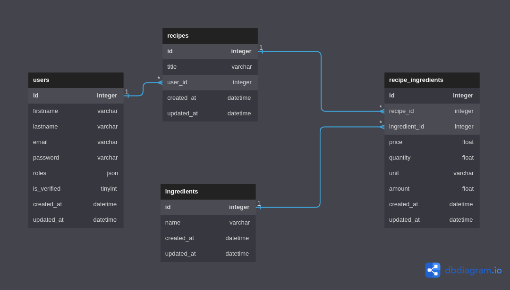

# Fry-Nance

## Data dictionnary

| Entity            | Name        | Description                      | Type     |
|-------------------|-------------|----------------------------------|----------|
| User              | id          | primary key, AI                  | int      |
| User              | firstname   |                                  | varchar  |
| User              | lastname    |                                  | varchar  |
| User              | email       | unique                           | varchar  |
| User              | password    |                                  | varchar  |
| User              | roles       | list of user's roles             | json     |
| User              | is_verified | used for email confirmation      | tinyint  |
| User              | created_at  | date of creation                 | datetime |
| User              | updated_at  | last update                      | datetime |
| Recipe            | id          | primary key, AI                  | int      |
| Recipe            | title       |                                  | varchar  |
| Recipe            | user_id     | owner of the recipe, FK          | int      |
| Recipe            | created_at  |                                  | datetime |
| Recipe            | updated_at  |                                  | datetime |
| Ingredient        | id          | primary key, AI                  | int      |
| Ingredient        | name        |                                  | varchar  |
| Ingredient        | created_at  |                                  | datetime |
| Ingredient        | updated_at  |                                  | datetime |
| Recipe_Ingredient | id          | primary_key, AI                  | int      |
| Recipe_Ingredient | recipe_id   | FK                               | int      |
| Recipe_Ingredient | price       | price of the ingredient          | float    |
| Recipe_Ingredient | quantity    | total quantity of the ingredient | float    |
| Recipe_Ingredient | unit        | unit of measure used             | float    |
| Recipe_Ingredient | amount      | quantity needed in the recipe    | float    |
| Recipe_Ingredient | created_at  |                                  | datetime |
| Recipe_Ingredient | updated_at  |                                  | datetime |

## Database Diagram
