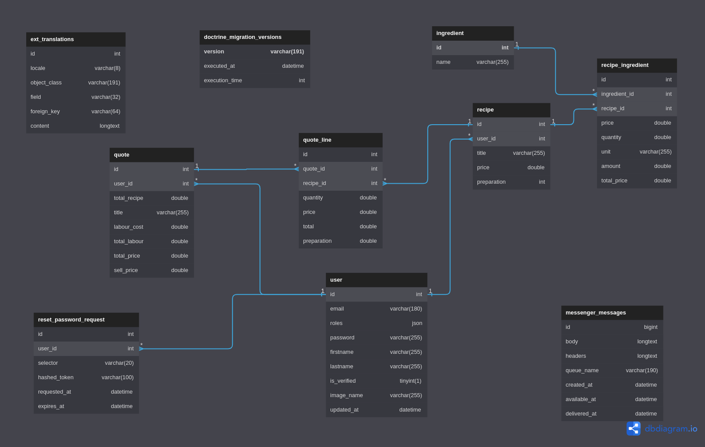

# Fry-Nance

## Project

Frynance is a web-based application specifically designed to help culinary enthusiasts, professional chefs, and restaurant owners in managing their recipe costs efficiently. It enables the users to register, log in, save their recipes and create quotes, each having a detailed list of ingredients with their respective quantities. The application's standout feature is the calculation of a recipe's final cost, which aids in determining a profitable selling price for the dish. The platform also supports multi-language, password recovery, and order addition functionalities, ensuring an intuitive and user-friendly experience.

## Installation

1. Clone the repository 
```sh
git clone https://github.com/VincentSureau/frynance.git
```

2. Configure environnement variables
```sh
cp .env.local
# Then fill environment variables with your actual local configuration
```

3. Install PHP dependencies
```sh
composer install
```

4. Install Frontend dependencies
```sh
yarn install
yarn encore dev
# OR
npm install
npm run dev
```

5. Create database and schema
```sh
symfony console doctrine:database:create
symfony console doctrine:migration:migrate -n
# OR
php bin/console doctrine:database:create
php bin/console doctrine:migration:migrate -n
```

6. Run tests
```sh
./vendor/bin/simple-phpunit
```

7. Run the project locally
```sh
symfony server:start
# Then browse the given URL
```

## Data dictionnary

|Table                      |Field         |Type    |Nullable|Comment       |
|---------------------------|--------------|--------|--------|--------------|
|doctrine_migration_versions|version       |varchar |NO      |              |
|doctrine_migration_versions|executed_at   |datetime|YES     |              |
|doctrine_migration_versions|execution_time|int     |YES     |              |
|ext_translations           |id            |int     |NO      |auto_increment|
|ext_translations           |locale        |varchar |NO      |              |
|ext_translations           |object_class  |varchar |NO      |              |
|ext_translations           |field         |varchar |NO      |              |
|ext_translations           |foreign_key   |varchar |NO      |              |
|ext_translations           |content       |longtext|YES     |              |
|ingredient                 |id            |int     |NO      |auto_increment|
|ingredient                 |name          |varchar |NO      |              |
|messenger_messages         |id            |bigint  |NO      |auto_increment|
|messenger_messages         |body          |longtext|NO      |              |
|messenger_messages         |headers       |longtext|NO      |              |
|messenger_messages         |queue_name    |varchar |NO      |              |
|messenger_messages         |created_at    |datetime|NO      |              |
|messenger_messages         |available_at  |datetime|NO      |              |
|messenger_messages         |delivered_at  |datetime|YES     |              |
|quote                      |id            |int     |NO      |auto_increment|
|quote                      |user_id       |int     |NO      |              |
|quote                      |total_recipe  |double  |NO      |              |
|quote                      |title         |varchar |NO      |              |
|quote                      |labour_cost   |double  |NO      |              |
|quote                      |total_labour  |double  |NO      |              |
|quote                      |total_price   |double  |NO      |              |
|quote                      |sell_price    |double  |NO      |              |
|quote_line                 |id            |int     |NO      |auto_increment|
|quote_line                 |quote_id      |int     |NO      |              |
|quote_line                 |recipe_id     |int     |NO      |              |
|quote_line                 |quantity      |double  |NO      |              |
|quote_line                 |price         |double  |NO      |              |
|quote_line                 |total         |double  |NO      |              |
|quote_line                 |preparation   |double  |NO      |              |
|recipe                     |id            |int     |NO      |auto_increment|
|recipe                     |user_id       |int     |NO      |              |
|recipe                     |title         |varchar |NO      |              |
|recipe                     |price         |double  |NO      |              |
|recipe                     |preparation   |int     |NO      |              |
|recipe_ingredient          |id            |int     |NO      |auto_increment|
|recipe_ingredient          |recipe_id     |int     |NO      |              |
|recipe_ingredient          |ingredient_id |int     |NO      |              |
|recipe_ingredient          |price         |double  |NO      |              |
|recipe_ingredient          |quantity      |double  |NO      |              |
|recipe_ingredient          |unit          |varchar |NO      |              |
|recipe_ingredient          |amount        |double  |NO      |              |
|recipe_ingredient          |total_price   |double  |NO      |              |
|reset_password_request     |id            |int     |NO      |auto_increment|
|reset_password_request     |user_id       |int     |NO      |              |
|reset_password_request     |selector      |varchar |NO      |              |
|reset_password_request     |hashed_token  |varchar |NO      |              |
|reset_password_request     |requested_at  |datetime|NO      |              |
|reset_password_request     |expires_at    |datetime|NO      |              |
|user                       |id            |int     |NO      |auto_increment|
|user                       |email         |varchar |NO      |              |
|user                       |roles         |json    |NO      |              |
|user                       |password      |varchar |NO      |              |
|user                       |firstname     |varchar |NO      |              |
|user                       |lastname      |varchar |NO      |              |
|user                       |is_verified   |tinyint |NO      |              |
|user                       |image_name    |varchar |YES     |              |
|user                       |updated_at    |datetime|YES     |              |

## Database Diagram


## Dependencies

| Library | Link | Short Description |
| ------ | ------ | ------ |
|Frontend|||
| Bootstrap | [Bootstrap](https://getbootstrap.com/) | A responsive front-end framework for faster and easier web development. |
| Jquery | [Jquery](https://jquery.com/) | A fast, small, and feature-rich JavaScript library to simplify HTML DOM tree traversal and manipulation. |
| Mazer | [Mazer](https://github.com/zuramai/mazer) | An admin dashboard template that combines multiple components for interface building. |
| Sass | [Sass](https://sass-lang.com/) | A mature, stable, and powerful professional grade CSS extension language. |
| Fontawesome | [Fontawesome](https://fontawesome.com/) | A full suite of scalable vector icons that can be customized with CSS. |
| Select 2 | [Select 2](https://select2.org/) | A jQuery based customizable select box with support for searching, tagging, remote data sets, infinite scrolling, and many other options. |
|Frontend|||
| Symfony | [Symfony](https://symfony.com/) | A PHP web application framework for MVC applications. |
| stof doctrine extensions | [stof doctrine extensions](https://github.com/stof/StofDoctrineExtensionsBundle) | Doctrine2 behavioral extensions, such as Translatable, Sluggable, Tree, etc. |
| Knp Paginator Bundle | [Knp Paginator Bundle](https://github.com/KnpLabs/KnpPaginatorBundle) | A Symfony bundle for paginating arrays and objects. |
| vich Uploader Bundle | [vich Uploader Bundle](https://github.com/dustin10/VichUploaderBundle) | A bundle to ease file uploads attached to entities. |
| Webpack Encore Bundle | [Webpack Encore Bundle](https://github.com/symfony/webpack-encore-bundle) | A simple JavaScript and CSS compiler for Symfony apps. |
| Reset Password Bundle | [Reset Password Bundle](https://github.com/SymfonyCasts/reset-password-bundle) | A bundle that provides a secure and robust way to reset a user's password. |
| Verify Email Bundle | [Verify Email Bundle](https://github.com/SymfonyCasts/verify-email-bundle) | A bundle that provides a customizable system for email verification. |