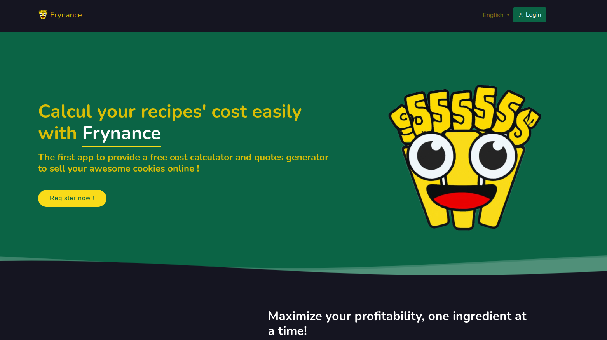

<h1 align="center">Frynance</h1>


<p align="center">
	<a href="https://frynance.webmonkey.fr/en/">Demo website</a>
</p>

## Video Demo:  https://youtu.be/kY9XzT2V0XU

## Description:
Frynance is a web-based application specifically designed to help culinary enthusiasts, professional chefs, and restaurant owners in managing their recipe costs efficiently. It enables the users to register, log in, save their recipes and create quotes, each having a detailed list of ingredients with their respective quantities. The application's standout feature is the calculation of a recipe's final cost, which aids in determining a profitable selling price for the dish. The platform also supports multi-language, password recovery, and order addition functionalities, ensuring an intuitive and user-friendly experience.

## Installation

1. Clone the repository 
```sh
git clone https://github.com/VincentSureau/frynance.git
```

2. Configure environnement variables
```sh
cp .env.local
# Then fill environment variables with your actual local configuration
```

3. Install PHP dependencies
```sh
composer install
```

4. Install Frontend dependencies
```sh
yarn install
yarn encore dev
# OR
npm install
npm run dev
```

5. Create database and schema
```sh
symfony console doctrine:database:create
symfony console doctrine:migration:migrate -n
# OR
php bin/console doctrine:database:create
php bin/console doctrine:migration:migrate -n
```

6. Run tests
```sh
./vendor/bin/simple-phpunit
```

7. Run the project locally
```sh
symfony server:start
# Then browse the given URL
```

## Database

### Data dictionnary

|Table                      |Field         |Type    |Nullable|Comment       |
|---------------------------|--------------|--------|--------|--------------|
|doctrine_migration_versions|version       |varchar |NO      |              |
|doctrine_migration_versions|executed_at   |datetime|YES     |              |
|doctrine_migration_versions|execution_time|int     |YES     |              |
|ext_translations           |id            |int     |NO      |auto_increment|
|ext_translations           |locale        |varchar |NO      |              |
|ext_translations           |object_class  |varchar |NO      |              |
|ext_translations           |field         |varchar |NO      |              |
|ext_translations           |foreign_key   |varchar |NO      |              |
|ext_translations           |content       |longtext|YES     |              |
|ingredient                 |id            |int     |NO      |auto_increment|
|ingredient                 |name          |varchar |NO      |              |
|messenger_messages         |id            |bigint  |NO      |auto_increment|
|messenger_messages         |body          |longtext|NO      |              |
|messenger_messages         |headers       |longtext|NO      |              |
|messenger_messages         |queue_name    |varchar |NO      |              |
|messenger_messages         |created_at    |datetime|NO      |              |
|messenger_messages         |available_at  |datetime|NO      |              |
|messenger_messages         |delivered_at  |datetime|YES     |              |
|quote                      |id            |int     |NO      |auto_increment|
|quote                      |user_id       |int     |NO      |              |
|quote                      |total_recipe  |double  |NO      |              |
|quote                      |title         |varchar |NO      |              |
|quote                      |labour_cost   |double  |NO      |              |
|quote                      |total_labour  |double  |NO      |              |
|quote                      |total_price   |double  |NO      |              |
|quote                      |sell_price    |double  |NO      |              |
|quote_line                 |id            |int     |NO      |auto_increment|
|quote_line                 |quote_id      |int     |NO      |              |
|quote_line                 |recipe_id     |int     |NO      |              |
|quote_line                 |quantity      |double  |NO      |              |
|quote_line                 |price         |double  |NO      |              |
|quote_line                 |total         |double  |NO      |              |
|quote_line                 |preparation   |double  |NO      |              |
|recipe                     |id            |int     |NO      |auto_increment|
|recipe                     |user_id       |int     |NO      |              |
|recipe                     |title         |varchar |NO      |              |
|recipe                     |price         |double  |NO      |              |
|recipe                     |preparation   |int     |NO      |              |
|recipe_ingredient          |id            |int     |NO      |auto_increment|
|recipe_ingredient          |recipe_id     |int     |NO      |              |
|recipe_ingredient          |ingredient_id |int     |NO      |              |
|recipe_ingredient          |price         |double  |NO      |              |
|recipe_ingredient          |quantity      |double  |NO      |              |
|recipe_ingredient          |unit          |varchar |NO      |              |
|recipe_ingredient          |amount        |double  |NO      |              |
|recipe_ingredient          |total_price   |double  |NO      |              |
|reset_password_request     |id            |int     |NO      |auto_increment|
|reset_password_request     |user_id       |int     |NO      |              |
|reset_password_request     |selector      |varchar |NO      |              |
|reset_password_request     |hashed_token  |varchar |NO      |              |
|reset_password_request     |requested_at  |datetime|NO      |              |
|reset_password_request     |expires_at    |datetime|NO      |              |
|user                       |id            |int     |NO      |auto_increment|
|user                       |email         |varchar |NO      |              |
|user                       |roles         |json    |NO      |              |
|user                       |password      |varchar |NO      |              |
|user                       |firstname     |varchar |NO      |              |
|user                       |lastname      |varchar |NO      |              |
|user                       |is_verified   |tinyint |NO      |              |
|user                       |image_name    |varchar |YES     |              |
|user                       |updated_at    |datetime|YES     |              |

### Diagram


## Dependencies

| Library | Link | Short Description |
| ------ | ------ | ------ |
|Frontend|||
| Bootstrap | [Bootstrap](https://getbootstrap.com/) | A responsive front-end framework for faster and easier web development. |
| Jquery | [Jquery](https://jquery.com/) | A fast, small, and feature-rich JavaScript library to simplify HTML DOM tree traversal and manipulation. |
| Mazer | [Mazer](https://github.com/zuramai/mazer) | An admin dashboard template that combines multiple components for interface building. |
| Sass | [Sass](https://sass-lang.com/) | A mature, stable, and powerful professional grade CSS extension language. |
| Fontawesome | [Fontawesome](https://fontawesome.com/) | A full suite of scalable vector icons that can be customized with CSS. |
| Select 2 | [Select 2](https://select2.org/) | A jQuery based customizable select box with support for searching, tagging, remote data sets, infinite scrolling, and many other options. |
|Backend|||
| Symfony | [Symfony](https://symfony.com/) | A PHP web application framework for MVC applications. |
| Stof doctrine extensions | [stof doctrine extensions](https://github.com/stof/StofDoctrineExtensionsBundle) | Doctrine2 behavioral extensions, such as Translatable, Sluggable, Tree, etc. |
| Knp Paginator Bundle | [Knp Paginator Bundle](https://github.com/KnpLabs/KnpPaginatorBundle) | A Symfony bundle for paginating arrays and objects. |
| Vich Uploader Bundle | [vich Uploader Bundle](https://github.com/dustin10/VichUploaderBundle) | A bundle to ease file uploads attached to entities. |
| Webpack Encore Bundle | [Webpack Encore Bundle](https://github.com/symfony/webpack-encore-bundle) | A simple JavaScript and CSS compiler for Symfony apps. |
| Reset Password Bundle | [Reset Password Bundle](https://github.com/SymfonyCasts/reset-password-bundle) | A bundle that provides a secure and robust way to reset a user's password. |
| Verify Email Bundle | [Verify Email Bundle](https://github.com/SymfonyCasts/verify-email-bundle) | A bundle that provides a customizable system for email verification. |

## Project structure

| File/Directory | Short Description |
| ------ | ------ |
| assets | The directory where you keep the front-end files like CSS, JavaScript, and images. |
| bin | Contains Symfony Console and PHP Unit executable files. |
| composer.json | Describes the dependencies of the project and other metadata. |
| composer.lock | Lock file generated by composer. Contains exact versions of dependencies. |
| config | This directory contains all the application's configuration. |
| drivers | Directory where Symfony Panther browers drivers are stored. |
| migrations | Directory where Doctrine migrations are stored. |
| node_modules | Contains all the Node.js dependencies of the project. |
| package.json | File that describes the Node.js dependencies. |
| phpunit.xml.dist | Configuration file for PHPUnit, a testing framework for PHP. |
| public | This is the document root of the project. It contains the front controller and the assets. |
| src | This directory contains all the PHP code of the application. |
| src/Controller | This directory is where all the controllers of the application are stored. Controllers are responsible for handling each HTTP request that the application receives. |
| src/DataFixtures | This directory contains the classes used to create data fixtures - useful for populating the database with fake or test data. |
| src/EventListener | This directory contains event listener classes, which contain code that is run in response to various events occurring in the application. |
| src/Kernel.php | This is the main entry point of the application's configuration. It configures things like bundles, caching, routes etc. |
| src/Security | This directory contains the classes that make up the application's security system: login, users account checking and email verification . |
| src/Twig | The directory contains custom Twif components and extensions. |
| src/Core | Contains listeners for locale, authorisations and errors. |
| src/Entity | This directory contains all the Doctrine entities. Entities in Symfony are PHP objects that represent rows in a database table. |
| src/Form | This directory is where the application's forms are stored. |
| src/Repository | This directory contains all the Doctrine repositories. Repositories are used to fetch and store data in the database, encapsulating the actual SQL queries. |
| src/Service | Contains services used by the application: MyMemoryApi. |
| src/Utils | Contains helper classes. |
| symfony.lock | This file lets Symfony Flex keep track of the recipes it installed. |
| templates | This directory contains all the Twig (HTML) templates. |
| tests | This directory contains all the test files. |
| translations | This directory contains application translation files. |
| var | Contains generated files (cache, log). |
| vendor | Contains the Composer dependencies. |
| webpack.config.js | The configuration file for Webpack, a module bundler. |